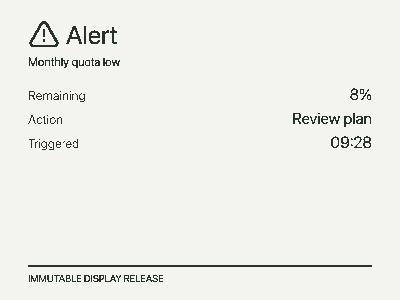

# Display — every screen on the hardware

This document enumerates **every** screen the Waveshare ESP32-S3-RLCD-4.2
panel can show. Each screen has a rendered PNG (in [image/](image/))
plus a text description of its content, text/characters, font, and layout so a
reader or LLM can reproduce it without inspecting the image.

- **Panel**: 400 × 300 px, 1-bit, MSB-first, reflective ST7305. A set bit is
  black. Every frame is exactly 15,000 bytes (`400 × 300 / 8`), format
  `mono1-msb`.
- **Two render paths**:
  1. **Console-rendered** (A-pages): the control plane rasterizes a
     `Display_document` to a verified `mono1-msb` frame via
     `render_device_bitmap` ([console/src/server/preview.ts](console/src/server/preview.ts)).
     Text = Noto Sans SC subset (Latin + CJK, GB2312), hard-thresholded to
     1-bit. Icons = Lucide SVG paths, 32×32 px.
  2. **Firmware-rendered** (D/E/F/G): drawn by `firmware/src/local_screen.rs`
     with a 5×7 uppercase glyph table (`draw_glyph`, scale 2–6) and Lucide
     icon bitmaps (`icon_bitmaps.rs`). No font on device, no SVG parsing.

## Layout constants

- **Border**: none on console pages (the physical bezel frames the screen; a
  software border wastes perimeter pixels). Firmware screens keep a 2 px border
  `rectangle(12, 12, 376, 276)` so the local-rendered status frames are
  visually self-contained during provisioning/maintenance.
- **No brand text**: there is no `GLANCE DECK` banner — the device does not
  self-brand.
- **Content margin**: 28 px (console). Icon + title share the header row:
  icon (28, 22), title baseline y=52. Subtitle y=74, content from y=110,
  footer rule y=266, footer text y=282.
- **CJK**: Noto Sans SC subset covers GB2312 + Latin. CJK glyphs are ~1em
  wide vs Latin ~0.5em; lines mix CJK labels with Latin/CJK values. Line wrap
  is by the console rasterizer, not the device.
- **Page indicator dots**: count = console-configured enabled page count
  (1–10), **dynamic from the backend**, not a constant. The **last dot is
  always the System page** (`page_id=system`), pinned regardless of how many
  content pages precede it. Centered at bottom y=282, 10×10 px each.

## Icon reference

| Screen | Icon | Lucide name | Source | Size |
|---|---|---|---|---|
| A1 Usage | trend | `trending-up` | console SVG | 32×32 |
| A2 Alerts | alert | `triangle-alert` | console SVG | 32×32 |
| A3 Home | home | `house` | console SVG | 32×32 |
| A4 System | monitor | `monitor` | console SVG | 32×32 |
| D1 Pairing | link | `link` | firmware bitmap | 56×56 |
| D2 Wi-Fi | wifi | `wifi` | firmware bitmap | 64×64 |
| E1 Maintenance | gear | `cog` | firmware bitmap | 64×64 |
| E4a Checking | spinner | `loader-circle` | firmware bitmap | 48×48 |
| F OTA download | download | `arrow-down-to-line` | firmware bitmap | 48×48 |

Console icons are embedded in `render_icon`; firmware icons are baked into
`firmware/src/icon_bitmaps.rs` by `firmware/scripts/gen-icon-bitmaps.ts`.

---


## A. Normal pages (console-rendered, verified)

All A-pages are rasterized by the console (`render_device_bitmap`,
[console/src/server/preview.ts](console/src/server/preview.ts)) from a
`Display_document` into a 1-bit `mono1-msb` frame. Text uses Noto Sans SC
(GB2312 + Latin subset), hard-thresholded to black/white. Icons are Lucide SVG
paths scaled to 32×32 px. **No software border** (physical bezel frames the
screen), **no brand text**. Layout: 28 px content margin, icon (28,18) +
title y=44, subtitle y=66, content from y=100, footer rule y=266, footer
text y=282.

### A1. Usage


Reproducible spec — every element with font, size, color (fill), anchor (x,y),
and alignment. Font: Noto Sans SC. Colors: `#26322a` (dark, "black"),
`#627168` (mid, muted), `#9ba89f` (rule). Background `#f2f4ed`. Coordinates are
SVG baseline/anchor points on a 400×300 canvas, **no border**.

| Element | Text | Font size | Weight | Color | x,y (anchor) | Align |
|---|---|---|---|---|---|---|
| Icon | Lucide `trending-up` | 32×32 px | — | `#26322a` stroke, 2 px | (28, 18) top-left | — |
| Title | `Usage` | 26 | 400 | `#26322a` | (66, 44) | left |
| Subtitle | `Codex subscription` | 12 | 400 | `#627168` | (28, 66) | left |
| Bar 1 label | `Day 10%` | 13 | 400 | `#627168` | (28, 100) | left |
| Bar 1 value | `79 / 776 USD` | 13 | 700 | `#26322a` | (372, 100) | right |
| Bar 1 track | rect | 344×8, rx 4 | — | `none` stroke `#26322a` 2 px | (28, 112) | — |
| Bar 1 fill | rect | 34×4, rx 2 | — | `#26322a` | (30, 114) | — |
| Bar 2 | `Week 30%` / `618 / 2054 USD` | 13 | — | as above | label (28,132), value (372,132), bar (28,144) | — |
| Bar 3 | `Month 25%` / `2068 / 8216 USD` | 13 | — | as above | label (28,164), value (372,164), bar (28,176) | — |
| Line | `Resets` / `Tomorrow` | 13 / 16 | 400 / 700 | `#627168` / `#26322a` | (28, 228) / (372, 228) | left / right |
| Footer rule | line | — | — | `#9ba89f` | (28,266)→(372,266) | — |
| Footer text | `IMMUTABLE DISPLAY RELEASE` | 10 | 400 | `#627168` | (28, 282) | left |

Progress bar fill width = `round(344 × percent / 100) - 4`, clamped ≥ 0.
Sample values reflect aggregated usage limits (micro-USD ÷ 1e6): Day 79/776,
Week 618/2054, Month 2068/8216.

**CJK variant**: the same page renders in Chinese when the console document
uses CJK — title `用量`, subtitle `订阅`, bars `今日`/`本周`/`本月`,
`重置时间`=`明天`. Noto Sans SC subset covers these; CJK glyphs are ~1em
wide so the layout engine may drop one bar row if titles overflow. The device
receives the already-rasterized bitmap; it does not know the language.


### A2–A4. Alerts, Home, System

These share the A1 layout (icon + title/subtitle/lines/footer, no border, no
brand). Only the icon, texts, and line rows differ. Font: Noto Sans SC. Colors
as in A1 (`#26322a` dark, `#627168` muted). Line label = 13 px `#627168` left
at x=28; line value = 16 px bold `#26322a` right at x=372. First line y=110,
then 24 px row pitch.

| Screen | Image | Icon (Lucide, 32×32 at 28,18) | Title (26px, 66,44) | Subtitle (12px, 28,66) | Lines (label = value) |
|---|---|---|---|---|---|
| A2 Alerts |  | `triangle-alert` | `Alert` | `Monthly quota low` | `Remaining`=`8%` (y100), `Action`=`Review plan` (y124), `Triggered`=`09:28` (y148) |
| A3 Home |  | `house` | `Home` | `Good morning` | `Calendar`=`2 events` (y100), `Temperature`=`24 C` (y124), `Humidity`=`48%` (y148) |
| A4 System |  | `monitor` | `System` | `Last verified page retained` | `Wi-Fi`=`Reconnect` (y100), `Last update`=`09:30` (y124), `Power`=`Battery N/A` (y148), `Firmware`=`0.1.0` (y172) |

`usage`, `alerts`, `home`, `environment`, `system` are naming conventions,
not special firmware types — any page id works. Up to 10 enabled pages.

### A5. Page indicator overlay (2 s, after any page change)


| Element | Spec |
|---|---|
| Dot count | **dynamic** = console-configured enabled page count for this device (1–10), fetched from the backend — not a constant |
| Last dot | **always the System page** (`page_id=system`), pinned as the rightmost dot regardless of how many content pages precede it |
| Active dot | filled 10×10 px rect, `#26322a` |
| Inactive dot | outlined 10×10 px rect, 2 px stroke `#26322a`, fill none |
| Position | centered horizontally at bottom y=282; spacing 28 px center-to-center; group centered: `start = (400 - count×28)/2 + 10` |
| Duration | 2 s after any page change, then hidden |
| Disabled | reduced-motion mode, critical-battery (<10%) |
| Animation | never animates during the change; appears only after flush |

### A6. Offline retention


When offline, the **last verified console page bitmap is retained verbatim** —
the device flushes the cached 1-bit frame (an A1/A2/A3/A4 page with Noto Sans
SC text, icons, progress bars), **not** a re-drawn text screen. The panel is
never blanked, no spinner. Cached pages remain locally switchable; an uncached
requested target waits for connectivity without replacing the visible frame.

The only offline overlay is the status: the page's status slot shows `Offline`
instead of `Online` (top-right of the retained page). The sample shows a
retained A1 Usage page with `Offline` status.

| Element | Source | Note |
|---|---|---|
| Page body | retained A1 console bitmap | the exact last flushed frame, not redrawn |
| Status text | `Offline` (was `Online`) | top-right status slot of the retained page |
| Dots | A5 indicator, dynamic count, last=system | active = current cached page |


---

## B. Boot / runtime

### B1. Boot — cached active page


On boot: reads `cache.current_release()`, validates the active page SHA-256,
flushes the verified frame, then calls `mark_running_image_healthy()`. The
device shows the **cached console page bitmap** (A1-style) — not a redrawn
text screen. A small `CACHED` source note may overlay the corner.

| Element | Source | Note |
|---|---|---|
| Page body | retained A1 console bitmap | exact last flushed frame |
| Note | `CACHED` (optional, 5×7 scale 2) | bottom-right corner |
| Dots | A5 indicator, dynamic count, last=system | active = cached active page |

### B2. Boot — no release yet → pairing (see D1)

A newly enrolled device with no cached release falls through to enrollment and
shows the D1 pairing screen.

---

## C. Local navigation (short KEY)


Trigger: short KEY press advances to the next enabled cached page, wrapping
around. Firmware flushes the verified target frame, overlays the A5 dots for
2 s, then reports the confirmed page to MQTT only after the flush succeeds.

| Element | Source | Note |
|---|---|---|
| Page body | the newly-selected cached page bitmap | A1/A2/A3/A4-style, not redrawn |
| Dots | A5 indicator, dynamic count, last=system | active = newly selected page |

---

## D. Enrollment & provisioning (firmware-rendered)

All D/E/G screens are drawn by firmware `firmware/src/local_screen.rs` with a
bounded 5×7 uppercase glyph table (`draw_glyph`) and Lucide icon bitmaps
(`icon_bitmaps.rs`). No font on device, no SVG parsing. Border 12..388 ×
12..288 (2 px stroke).

### D1. Pairing code


All elements drawn by firmware `local_screen.rs` (5×7 glyph table `draw_glyph`
+ Lucide bitmap blit). Border: `rectangle(12,12,376,276)`, 2 px. Code is
short-lived, generated locally, never sent to MQTT. Digits use scale 6 (not 8)
so the caption clears the bottom border.

| Element | Text/Content | Glyph | Scale (→ px) | x,y (top-left) | Align |
|---|---|---|---|---|---|
| Border | rect 376×276, 2 px stroke | — | — | (12, 12) | — |
| Icon | Lucide `link` bitmap | 56×56 | — | ((400-56)/2=172, 40) | center-x |
| Digit 1 | `1` | 5×7 digit | 6 (30×42) | (95, 110) | — |
| Digit 2 | `2` | 5×7 digit | 6 | (95+36=131, 110) | — |
| Digit 3 | `3` | 5×7 digit | 6 | (167, 110) | — |
| Digit 4 | `4` | 5×7 digit | 6 | (203, 110) | — |
| Digit 5 | `5` | 5×7 digit | 6 | (239, 110) | — |
| Digit 6 | `6` | 5×7 digit | 6 | (275, 110) | — |
| Caption | `ENTER CODE IN CONSOLE` | 5×7 | 3 (15×21) | centered, y=190 | center |

Digit pitch = `5×scale + scale` = 36 px (scale 6). First digit left =
`(400 - 6×36 + 6) / 2 = 95`. Icon at y=40, digits at y=110 (height 42 → ends
152), caption at y=190 — all clear of the 288 border.

### D2. Wi-Fi setup credentials


Drawn by firmware. Trigger: station reconnect fails or first boot with no
Wi-Fi — device starts a WPA2 SoftAP and shows its SSID and password. Both are
labeled on screen so the user knows which is which. Per-start, never in MQTT,
never in normal display docs.

| Element | Text/Content | Glyph | Scale (→ px) | x,y | Align |
|---|---|---|---|---|---|
| Border | rect 376×276, 2 px | — | — | (12, 12) | — |
| Icon | Lucide `wifi` bitmap | 64×64 | — | ((400-64)/2=168, 36) | center-x |
| Title | `WIFI SETUP` | 5×7 | 3 (15×21) | centered, y=120 | center |
| SSID label | `SSID` | 5×7 | 2 (10×14) | (60, 160) | left |
| SSID value | `GlanceDeck-AB12` | 5×7 | 2 | (160, 160) | left |
| Password label | `PASSWORD` | 5×7 | 2 | (60, 195) | left |
| Password value | `GD12AB34EF` (10 chars, A–Z0–9) | 5×7 | 2 | (160, 195) | left |

SSID is derived from the device id (e.g. `GlanceDeck-<4 hex>`); password is
per-start random. Both shown only on this screen.

---

## E. Maintenance flow (firmware-rendered, ≤16 uppercase chars)

Long KEY on a normal page enters maintenance. Short KEY cancels → last normal
page. Status text uses the 5×7 glyph table (`draw_glyph`), uppercase ASCII +
digits + space only, scale 2 (10×14), 3 (15×21), or 4 (20×28). All centered.
Border: `rectangle(12,12,376,276)`.

### E1. Maintenance overview (1st long press)


| Element | Text/Content | Glyph | Scale (→ px) | x,y | Align |
|---|---|---|---|---|---|
| Border | rect 376×276, 2 px | — | — | (12, 12) | — |
| Icon | Lucide `cog` bitmap | 64×64 | — | (168, 34) | center-x |
| Text | `MAINTENANCE` | 5×7 | 4 (20×28) | centered, y≈136 (vertical center) | center |

### E2. Wi-Fi setup confirmation (2nd long press)


| Element | Text | Glyph | Scale (→ px) | x,y | Align |
|---|---|---|---|---|---|
| Border | rect 376×276 | — | — | (12,12) | — |
| Title | `HOLD 3X` | 5×7 | 4 (20×28) | centered, y=110 | center |
| Hint 1 | `LONG AGAIN TO START AP` | 5×7 | 2 (10×14) | centered, y=175 | center |
| Hint 2 | `SHORT TO CANCEL` | 5×7 | 2 | centered, y=200 | center |

### E3. Starting Wi-Fi setup (3rd long press → restart)


| Element | Text | Glyph | Scale (→ px) | x,y | Align |
|---|---|---|---|---|---|
| Border | rect 376×276 | — | — | (12,12) | — |
| Title | `STARTING` | 5×7 | 4 | centered, y=110 | center |
| Hint 1 | `REPROVISIONING REQUESTED` | 5×7 | 2 | centered, y=175 | center |
| Hint 2 | `RESTARTING` | 5×7 | 2 | centered, y=200 | center |

Device then restarts into the SoftAP (D2).

### E4. Local OTA check sub-states (short press from maintenance)

**E4a — immediately after the check request:**


| Element | Text/Content | Glyph | Scale (→ px) | x,y | Align |
|---|---|---|---|---|---|
| Icon | Lucide `loader-circle` (spinner) | 48×48 | — | centered, y=70 | center-x |
| Text | `CHECKING UPDATE` | 5×7 | 3 (15×21) | centered, y=150 | center |

The spinner icon rotates 90° per frame refresh (4-frame cycle, ~500 ms/step)
to signal activity — not smooth animation, just stepped rotation on each
reflective-LCD refresh.

**E4b — control plane returned a candidate (not yet applied):**


| Element | Text/Content | Glyph | Scale (→ px) | x,y | Align |
|---|---|---|---|---|---|
| Title | `UPDATE READY` | 5×7 | 3 (15×21) | centered, y=90 | center |
| Version | `VERSION 0.2.0` | 5×7 | 2 (10×14) | centered, y=125 | center |
| Size | `SIZE 1.2 MB` | 5×7 | 2 | centered, y=150 | center |
| Hint 1 | `LONG PRESS TO APPLY` | 5×7 | 2 | centered, y=195 | center |
| Hint 2 | `SHORT TO CANCEL` | 5×7 | 2 | centered, y=220 | center |

Version and size come from the `ota/check/state` payload (`version` and
`image_bytes`/content-length). A separate long press confirms; a short press
cancels back to the last normal page.

**E4c — no newer release:**


| Element | Text | Glyph | Scale (→ px) | x,y | Align |
|---|---|---|---|---|---|
| Text | `UP TO DATE` | 5×7 | 3 | centered, y=140 | center |

**E4d — control plane failed:**


| Element | Text/Content | Glyph | Scale (→ px) | x,y | Align |
|---|---|---|---|---|---|
| Title | `UPDATE CHECK FAILED` | 5×7 | 3 (15×21) | centered, y=120 | center |
| Reason | `<reason>` (≤16 chars) | 5×7 | 2 (10×14) | centered, y=160 | center |

The reason is mapped from the control plane's `error_message` and bounded to
≤16 uppercase ASCII chars (firmware glyph limit). Examples: `NO COMPATIBLE
RELEASE`, `NETWORK TIMEOUT`, `SIGNATURE INVALID`. If the message exceeds the
limit it is truncated with `...`.

---

## F. OTA status (remote + locally confirmed, shared phases)


Drawn by firmware. Phases: `Downloading` → `Verifying` → `Restarting`, then
`Checking`, `Complete`, `Rolled back`, or a concrete failure. OTA refused
below 30% battery unless external power (`power_unsafe_for_ota`). During the
`Downloading` phase a download icon and byte-progress are shown so the user
sees the update moving.

| Element | Text/Content | Glyph | Scale (→ px) | x,y | Align |
|---|---|---|---|---|---|
| Border | rect 376×276 | — | — | (12,12) | — |
| Icon | Lucide `arrow-down-to-line` | 48×48 | — | centered, y=50 | center-x |
| Title | `SYSTEM` | 5×7 | 3 (15×21) | (32, 95) | left |
| Phase | `OTA: DOWNLOADING` | 5×7 | 3 | (32, 120) | left |
| Progress | `42%` | 5×7 | 3 | (32, 150) | left |
| Progress bar track | rect 344×8, rx 4 | — | — | (28, 165), stroke `#26322a` 2 px | — |
| Progress bar fill | rect `round(344×42/100)-4`×4 | — | — | (30, 167) | — |
| Reminder | `KEEP POWER CONNECTED` | 5×7 | 2 (10×14) | (32, 210) | left |
| Flow | `DOWNLOAD -> VERIFY -> RESTART` | 5×7 | 2 | centered, y=240 | center |

Progress percentage = `round(downloaded_bytes / image_bytes × 100)`, shown only
during `Downloading`; hidden during `Verifying`/`Restarting` (those phases show
only the phase name). `image_bytes` comes from the release manifest.

---

## G. Error frame


Drawn by firmware. Never a bare `Error` — always paired with the specific
corrective action and, where available, a short reason. Audio is
supplementary; color is never the only cue (monochrome panel).

| Element | Text/Content | Glyph | Scale (→ px) | x,y | Align |
|---|---|---|---|---|---|
| Border | rect 376×276 | — | — | (12,12) | — |
| Title | `<failure>` (≤16 chars) | 5×7 | 3 (15×21) | centered, y=110 | center |
| Action | `<corrective action>` (≤16 chars) | 5×7 | 2 (10×14) | centered, y=150 | center |
| Reason | `<reason>` (≤16 chars, optional) | 5×7 | 2 | centered, y=180 | center |

Sample: title `WIFI CONN FAILED`, action `REOPEN SETUP`, reason `AUTH FAILED`.
All strings bounded to ≤16 uppercase ASCII chars; longer messages truncate
with `...`.

---

## State transition map

```
                       short KEY / show_page
   Normal page  ─────────────────────────────────►  verified target
   (cached)                                              │
       ▲                                                 │ 2 s dots
       │                                                 ▼
       │                                            normal page
       │ long KEY
       ▼
   MAINTENANCE ──long──► HOLD 3X ──long──► STARTING ──restart──► (D2 Wi-Fi setup)
       │                      │
       │ short                │ short
       │                      │
       ▼                      ▼
   CHECKING UPDATE       last normal page
       │
       ├──► UPDATE READY ──long──► OTA phases (F)
       ├──► UP TO DATE
       └──► UPDATE CHECK FAILED
```

---

## What the hardware never shows

```
- indefinite spinner / blank panel while offline
- color-only status cue
- arbitrary prose on pairing / Wi-Fi / maintenance frames
- credentials in MQTT state, non-serial logs, or the System page
- invented battery percentage (Battery unavailable until carrier installed)
```

---

## Sources

```
firmware/src/local_screen.rs         pairing_code_frame / maintenance_frame / wifi_setup_frame
                                     draw_pairing_icon (72x48) / draw_wifi_icon (80x70)
                                     / draw_maintenance_icon (72x48) / draw_glyph (5x7 @scale4)
                                     / draw_digit (38x72 seven-seg)
firmware/src/main.rs                 boot flush, maintenance long-press sequence, OTA-check states
firmware/src/display.rs              DisplayRelease / DisplayPage validation, 400x300 / 15000B / mono1-msb
firmware/src/rlcd.rs                 RlcdRenderer::flush_frame, show_pairing_code
firmware/docs/display.md             ASCII mockups (companion file)
firmware/docs/hardware-interaction.md   KEY gestures, power states, OTA thresholds
firmware/docs/display-assets.md      CJK font and release contract
```
