# Display — every screen on the hardware

This document enumerates **every** screen the Waveshare ESP32-S3-RLCD-4.2
panel can show. Each screen has a rendered PNG (in [image/](image/))
plus a text description of its content, text/characters, font, and layout so a
reader or LLM can reproduce it without inspecting the image.

- **Panel**: 400 × 300 px, 1-bit, MSB-first, reflective ST7305. A set bit is
  black. Every frame is exactly 15,000 bytes (`400 × 300 / 8`), format
  `mono1-msb`.
- **Two render paths**:
  1. **Console-rendered** (A-pages): the control plane rasterizes a
     `Display_document` to a verified `mono1-msb` frame via
     `render_device_bitmap` ([console/src/server/preview.ts](console/src/server/preview.ts)).
     Text = Noto Sans SC subset (Latin + CJK, GB2312), hard-thresholded to
     1-bit. Icons = Lucide SVG paths, 32×32 px.
  2. **Firmware-rendered** (B/D/E/F/G): drawn by `firmware/src/local_screen/`
     from the same Noto Sans SC source font as A-pages. The firmware embeds a
     pre-rasterized bounded ASCII subset for offline operation; it does not
     parse SVG or load a font file at runtime.

## Layout constants

- **Border**: none. The physical bezel frames both console and firmware pages.
- **No brand text**: there is no `GLANCE DECK` banner — the device does not
  self-brand.
- **Content margin**: 28 px (console). Icon + title share the header row:
  icon (28, 22), title baseline y=52. Subtitle y=74, content from y=110,
  footer rule y=266, footer text y=282.
- **CJK**: Noto Sans SC subset covers GB2312 + Latin. CJK glyphs are ~1em
  wide vs Latin ~0.5em; lines mix CJK labels with Latin/CJK values. Line wrap
  is by the console rasterizer, not the device.
- **Page indicator dots**: count = console-configured enabled page count
  (1–10), **dynamic from the backend**, not a constant. The **last dot is
  always the System page** (`page_id=system`), pinned regardless of how many
  content pages precede it. Centered at y=278, 8 px circular dots, 14 px apart.

## Icon reference

| Screen | Icon | Lucide name | Source | Size |
|---|---|---|---|---|
| A1 Usage | trend | `trending-up` | `lucide-react` SVG | 32×32 |
| A3 Home | home | `house` | `lucide-react` SVG | 32×32 |
| A4 System | monitor | `monitor` | `lucide-react` SVG | 32×32 |

Console icons are embedded in `render_icon`. Local device states reuse the
same Lucide source library at build time: `firmware/scripts/generate-local-icons.mjs`
renders the named Lucide SVG into 32×32 1-bit assets, and firmware only blits
those immutable assets. No local screen icon is hand-drawn or parsed at runtime.

---


## A. Normal pages (console-rendered, verified)

All A-pages are rasterized by the console (`render_device_bitmap`,
[console/src/server/preview.ts](console/src/server/preview.ts)) from a
`Display_document` into a 1-bit `mono1-msb` frame. Text uses Noto Sans SC
(GB2312 + Latin subset), hard-thresholded to black/white. Icons are Lucide SVG
paths scaled to 32×32 px. **No software border** (physical bezel frames the
screen), **no brand text**. Layout: 28 px content margin, icon (28,22) +
title y=52, subtitle y=74, content from y=110, footer rule y=266, footer
text y=282.

### A1. Usage

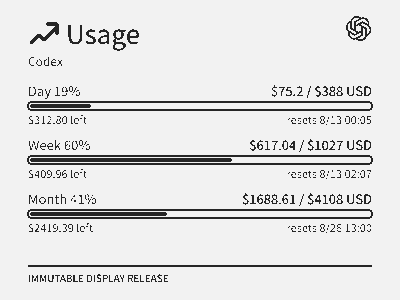

Reproducible spec — every element with font, size, color (fill), anchor (x,y),
and alignment. Font: Noto Sans SC. Colors: `#26322a` (dark, "black"),
`#627168` (mid, muted), `#9ba89f` (rule). Background `#f2f4ed`. Coordinates are
SVG baseline/anchor points on a 400×300 canvas, **no border**.

| Element | Text | Font size | Weight | Color | x,y (anchor) | Align |
|---|---|---|---|---|---|---|
| Icon | Lucide `trending-up` | 32×32 px | — | `#26322a` stroke, 2 px | (28, 18) top-left | — |
| Title | `Usage` | 26 | 400 | `#26322a` | (66, 44) | left, vertically centered with icon |
| Subtitle | `Codex` | 12 | 400 | `#627168` | (28, 66) | left |
| Bar 1 label/value | `Day 19%` / `$75.2 / $388 USD` | 13 | 400 / 700 | `#627168` / `#26322a` | y=96 | left / right |
| Bar 1 track/fill | rect | 344×8 / 344×4 | — | `#26322a` | y=102 / 104 | — |
| Bar 1 details | `$312.80 left` / `resets 8/13 00:05` | 11 | 400 | `#627168` | y=124 | left / right |
| Bar 2 | `Week 60%` / `$617.04 / $1027 USD`; `$409.96 left`; `resets 8/13 02:07` | 11–13 | 400 / 700 | as above | y=150, 156, 178 | — |
| Bar 3 | `Month 41%` / `$1688.61 / $4108 USD`; `$2419.39 left`; `resets 8/26 13:00` | 11–13 | 400 / 700 | as above | y=204, 210, 232 | — |
| Footer rule | line | — | — | `#26322a` | (28,266)→(372,266) | — |
| Footer text | `IMMUTABLE DISPLAY RELEASE` | 10 | 400 | `#26322a` | (28, 282) | left |

Progress bar fill width = `round(344 × percent / 100) - 4`, clamped ≥ 0.
The Usage reference frame uses Day 75.2/388, Week 617.04/1027, and Month
1688.61/4108 USD, with each row also showing remaining amount and reset time.

**CJK variant**: the same page renders in Chinese when the console document
uses CJK — title `用量`, subtitle `订阅`, bars `今日`/`本周`/`本月`,
`重置时间`=`明天`. Noto Sans SC subset covers these; CJK glyphs are ~1em
wide so the layout engine may drop one bar row if titles overflow. The device
receives the already-rasterized bitmap; it does not know the language.


### A2–A4. Home, System, and custom pages

These share the A1 layout (icon + title/subtitle/lines/footer, no border, no
brand). Only the icon, texts, and line rows differ. Font: Noto Sans SC. Colors
as in A1 (`#26322a` dark, `#627168` muted). Line label = 13 px `#627168` left
at x=28; line value = 16 px bold `#26322a` right at x=372. First line y=110,
then 24 px row pitch.

| Screen | Image | Icon (Lucide, 32×32 at 28,22) | Title | Subtitle | Lines (label = value) |
|---|---|---|---|---|---|
| A2 Home | 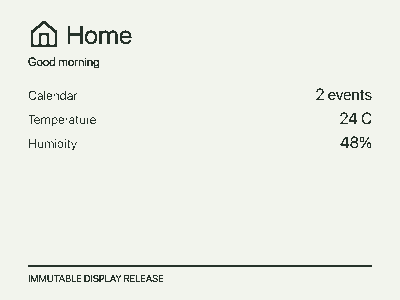 | `house` | `Home` | `Good morning` | `Calendar`=`2 events`, `Temperature`=`24 C`, `Humidity`=`48%` |
| A3 System | 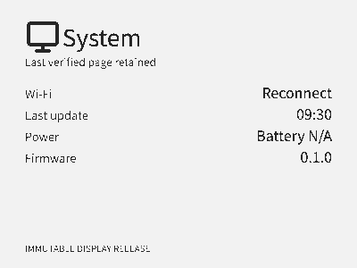 | `monitor` | `System` | `Last verified page retained` | `Wi-Fi`=`Reconnect`, `Last update`=`09:30`, `Power`=`Battery N/A`, `Firmware`=`0.1.0` |

Alerting remains a control-plane automation feature, not a special page type
or page-editor icon. Any ordinary page may present alert content.

### A5. Page indicator overlay (2 s, after any page change)


| Element | Spec |
|---|---|
| Dot count | **dynamic** = console-configured enabled page count for this device (1–10), fetched from the backend — not a constant |
| Last dot | **always the System page** (`page_id=system`), pinned as the rightmost dot regardless of how many content pages precede it |
| Active dot | filled 8 px circle, `#26322a` |
| Inactive dot | outlined 8 px circle, `#26322a`, fill none |
| Position | centered horizontally at y=278; spacing 14 px center-to-center |
| Duration | 2 s after any page change, then hidden |
| Disabled | critical-battery (<10%) |
| Restore | after 2 s firmware flushes the original verified cached frame |

### A6. Offline retention


When offline, the **last verified console page bitmap is retained verbatim** —
the device flushes the cached 1-bit frame (an A1/A2/A3/A4 page with Noto Sans
SC text, icons, progress bars), **not** a re-drawn text screen. The panel is
never blanked, no spinner. Cached pages remain locally switchable; an uncached
requested target waits for connectivity without replacing the visible frame.

There is no local text overlay: the offline page remains precisely the same
verified A-series bitmap that was last flushed.

| Element | Source | Note |
|---|---|---|
| Page body | retained A1 console bitmap | the exact last flushed frame, not redrawn |
| Dots | A5 indicator, dynamic count, last=system | active = current cached page |


---

## B. Boot / runtime

### B1. Boot — connecting

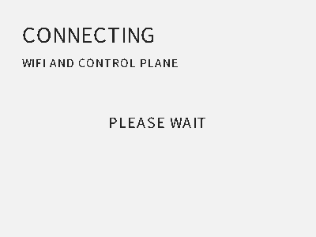

On boot the device first shows the local `CONNECTING` screen while Wi-Fi and
the control plane initialize. Once connected it validates and flushes the
active page. Cached pages remain an offline-retention fallback, not an
ambiguous boot-progress screen.

| Element | Source | Note |
|---|---|---|
| Title | `CONNECTING` | common local title row |
| Subtitle | `WIFI AND CONTROL PLANE` | common local subtitle row |
| Header icon | Wi-Fi glyph | right-aligned status symbol |
| Divider | 344 px rule | separates header from state |
| Body | three-stage connection track + `JOINING NETWORK` | first stage filled; no spinner |

### B2. Boot — no release yet → pairing (see D1)

A newly enrolled device with no cached release falls through to enrollment and
shows the D1 pairing screen.

---

## C. Local navigation (short KEY)

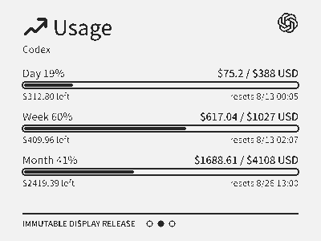

Trigger: short KEY press advances to the next enabled cached page, wrapping
around. Firmware flushes the verified target frame, overlays the A5 dots for
2 s, then reports the confirmed page to MQTT only after the flush succeeds.

| Element | Source | Note |
|---|---|---|
| Page body | the newly-selected cached page bitmap | A1/A2/A3/A4-style, not redrawn |
| Dots | A5 indicator, dynamic count, last=system | active = newly selected page |

---

## D. Enrollment & provisioning (firmware-rendered)

All D/E/G screens use the common firmware `local_screen` canvas and the same
Noto Sans SC typeface as A-pages, pre-rasterized into a bounded embedded ASCII
subset. Functional monochrome symbols, dividers, cards, and gesture geometry
are rasterized locally; no SVG parsing or runtime font loading is used.

### D1. Pairing code

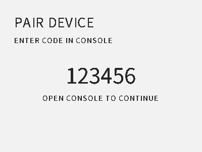

The pairing page states its purpose in the common local title/subtitle rows:
`PAIR DEVICE` / `ENTER CODE IN CONSOLE`. Its short-lived code is generated
locally and never sent to MQTT. It uses the same Noto Sans SC typeface as the
console and other local pages, at the large embedded size.

| Element | Text/Content | Glyph | Scale (→ px) | x,y (top-left) | Align |
|---|---|---|---|---|---|
| Header icon | Lucide `link` | `lucide-react` → firmware 1-bit asset | 32 px | (340, 26) | right |
| Title | `PAIR DEVICE` | Noto Sans SC | 26 px | (28, 26) | left |
| Subtitle | `ENTER CODE IN CONSOLE` | Noto Sans SC | 14 px | (28, 70) | left |
| Divider/card | rule + outlined code card | — | 344 px / 288×78 px | y=96 / (56,112) | — |
| Code | six digits | Noto Sans SC | 42 px | centered, y=124 | center |
| Hint | `ENTER THIS CODE IN CONSOLE` | Noto Sans SC | 14 px | centered, y=214 | center |

Each digit uses its Noto Sans SC advance width in the embedded 42 px raster;
the full six-digit value is centered inside the outlined card.

### D2. Wi-Fi setup credentials

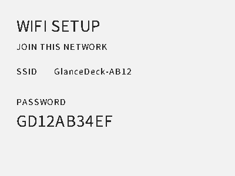

Drawn by firmware. Trigger: station reconnect fails or first boot with no
Wi-Fi — device starts a WPA2 SoftAP and shows its SSID and password. Both are
labeled on screen so the user knows which is which. Per-start, never in MQTT,
never in normal display docs.

| Element | Text/Content | Glyph | Scale (→ px) | x,y | Align |
|---|---|---|---|---|---|
| Header icon | Lucide `wifi` | `lucide-react` → firmware 1-bit asset | 32 px | (340, 26) | right |
| Title | `WIFI SETUP` | Noto Sans SC | 26 px | (28, 26) | left |
| Subtitle | `JOIN THIS NETWORK` | Noto Sans SC | 14 px | (28, 70) | left |
| Dividers | 344 px rules | — | 1 px | y=96,178 | — |
| SSID label/value | `SSID` / `GlanceDeck-AB12` | Noto Sans SC | 14 px / 26 px | (28,114) / (28,132) | left; value ellipsized at 344 px |
| Password label/value | `PASSWORD` / `GD12AB34EF` | Noto Sans SC | 14 px / 26 px | (28,194) / (28,212) | left |

SSID is derived from the device MAC (e.g. `GlanceDeck-<4 hex>`); password is
per-start random. The SSID value column is capped at 344 px and overlong names
are ellipsized with `...`; the password is never truncated. Both appear only
on this screen.

---

## E. Maintenance flow (firmware-rendered, ≤16 uppercase chars)

Long KEY on a normal page enters maintenance. Short KEY cancels → last normal
page. Maintenance and update-check screens use a shared local header, one
functional symbol, hairline separators, and compact gesture geometry.

### E1. Maintenance overview (1st long press)

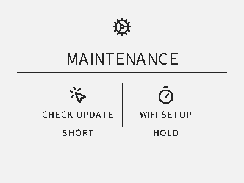

| Element | Text/Content | Glyph | Scale (→ px) | x,y | Align |
|---|---|---|---|---|---|
| Symbol | gear | — | 32 px | centered, y=28 | center |
| Title | `MAINTENANCE` | Noto Sans SC | 26 px | centered, y=78 | center |
| Structure | divider + two action columns | — | 344 px / 72 px | y=118 / x=200 | — |
| Left action | Lucide `mouse-pointer-click` / `CHECK UPDATE` / `SHORT` | Noto Sans SC | 32 px / 14 px | centered x=128, y=140/178/208 | center |
| Right action | Lucide `timer` / `WIFI SETUP` / `HOLD` | Noto Sans SC | 32 px / 14 px | centered x=272, y=140/178/208 | center |

### E2. Wi-Fi setup confirmation (2nd long press)

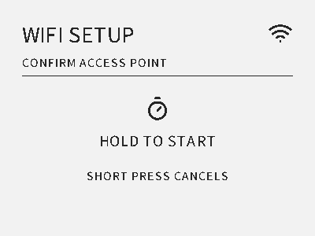

| Element | Text | Glyph | Scale (→ px) | x,y | Align |
|---|---|---|---|---|---|
| Header | Wi-Fi glyph / `WIFI SETUP` / `CONFIRM ACCESS POINT` | Noto Sans SC | 32 px / 26 px / 14 px | header row | — |
| Divider | 344 px rule | — | 1 px | y=96 | — |
| Action | Lucide `timer` / `HOLD TO START` | Noto Sans SC | 32 px / 18 px | centered, y=122/166 | center |
| Hint | `SHORT PRESS CANCELS` | Noto Sans SC | 14 px | centered, y=214 | center |

### E3. Starting Wi-Fi setup (3rd long press → restart)

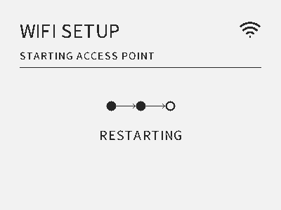

| Element | Text | Glyph | Scale (→ px) | x,y | Align |
|---|---|---|---|---|---|
| Header | Wi-Fi glyph / `WIFI SETUP` / `STARTING ACCESS POINT` | Noto Sans SC | 32 px / 26 px / 14 px | header row | — |
| Divider | 344 px rule | — | 1 px | y=96 | — |
| Body | two completed nodes in the three-stage track / `RESTARTING` | Noto Sans SC | 18 px | centered, y=144/180 | center |

Device then restarts into the SoftAP (D2).

### E4. Local OTA check sub-states (short press from maintenance)

**E4a — immediately after the check request:**

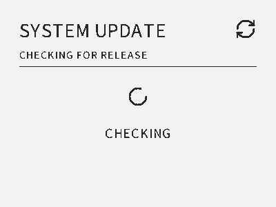

| Element | Text/Content | Glyph | Scale (→ px) | x,y | Align |
|---|---|---|---|---|---|
| Header | update glyph / `SYSTEM UPDATE` / `CHECKING FOR RELEASE` | Noto Sans SC | 32 px / 26 px / 14 px | header row | — |
| Divider | 344 px rule | — | 1 px | y=96 | — |
| State | check glyph / `CHECKING` | Noto Sans SC | 32 px / 18 px | centered, y=124/180 | center |

There is no spinner animation: repeatedly updating a reflective panel wastes
power and makes the background flicker.

**E4b — control plane returned a candidate (not yet applied):**

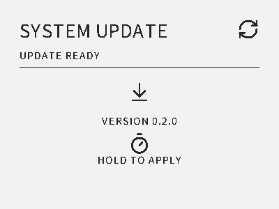

| Element | Text/Content | Glyph | Scale (→ px) | x,y | Align |
|---|---|---|---|---|---|
| Header | update glyph / `SYSTEM UPDATE` / `UPDATE READY` | Noto Sans SC | 32 px / 26 px / 14 px | header row | — |
| Divider | 344 px rule | — | 1 px | y=96 | — |
| Candidate | download glyph / `VERSION 0.2.0` | Noto Sans SC | 32 px / 14 px | centered, y=116/164 | center |
| Action | Lucide `timer` / `HOLD TO APPLY` | Noto Sans SC | 32 px / 14 px | centered, y=190/220 | center |

Version comes from the `ota/check/state` payload. A separate long press
confirms; a short press cancels back to the last normal page. The signed image
size is learned from the HTTPS response only when the download begins.

**E4c — no newer release:**

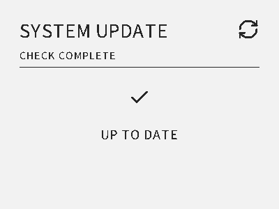

| Element | Text | Glyph | Scale (→ px) | x,y | Align |
|---|---|---|---|---|---|
| Header | update glyph / `SYSTEM UPDATE` / `CHECK COMPLETE` | Noto Sans SC | 32 px / 26 px / 14 px | header row | — |
| Divider | 344 px rule | — | 1 px | y=96 | — |
| State | check-mark glyph / `UP TO DATE` | Noto Sans SC | 32 px / 18 px | centered, y=124/180 | center |

**E4d — control plane failed:**

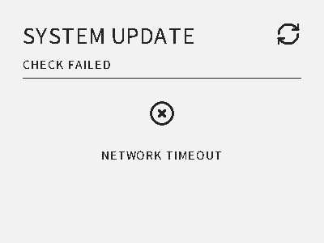

| Element | Text/Content | Glyph | Scale (→ px) | x,y | Align |
|---|---|---|---|---|---|
| Header | update glyph / `SYSTEM UPDATE` / `CHECK FAILED` | Noto Sans SC | 32 px / 26 px / 14 px | header row | — |
| Divider | 344 px rule | — | 1 px | y=96 | — |
| Reason | failure glyph / `<reason>` (≤16 chars) | Noto Sans SC | 32 px / 14 px | centered, y=124/182 | center |

The reason is mapped from the control plane's `error_message` and bounded to
≤16 uppercase ASCII chars (firmware glyph limit). Examples: `NO COMPATIBLE
RELEASE`, `NETWORK TIMEOUT`, `SIGNATURE INVALID`. If the message exceeds the
limit it is truncated with `...`.

---

## F. OTA status (remote + locally confirmed, shared phases)

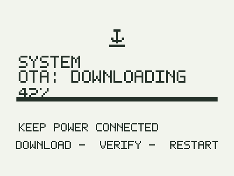

Drawn by firmware. Phases: `Downloading` → `Verifying` → `Restarting`, then
`Checking`, `Complete`, `Rolled back`, or a concrete failure. OTA is refused
below 30% battery unless external power (`power_unsafe_for_ota`). The device
uses a status layout rather than a hand-drawn download icon.

| Element | Text/Content | Glyph | Scale (→ px) | x,y | Align |
|---|---|---|---|---|---|
| Header | download glyph / `SYSTEM UPDATE` / current phase | Noto Sans SC | 32 px / 26 px / 14 px | header row | — |
| Divider | 344 px rule | — | 1 px | y=96 | — |
| Progress | `PROGRESS` / `42%` | Noto Sans SC | 14 px | row y=118, left/right | — |
| Progress bar track | rect 344×8 | — | — | (28,144), stroke 2 px | — |
| Progress bar fill | rect `round(344×42/100)-4`×4 | — | — | (30,146) | — |
| Reminder | `KEEP POWER CONNECTED` | Noto Sans SC | 14 px | centered, y=159 | center |
| Flow | three-stage node track | — | 99×15 px | centered, y=230 | active stages filled |

Progress percentage = `round(downloaded_bytes / image_bytes × 100)`, shown only
during `Downloading`; hidden during `Verifying`/`Restarting` (those phases show
only the phase name). It is refreshed at 10% boundaries and 100%, avoiding
per-chunk background flashing. The HTTPS download, manifest verification, and
OTA-partition writer run in a dedicated FreeRTOS-backed Rust worker; the UI task
is the sole owner of the display and receives bounded OTA state messages.

---

## G. Error frame

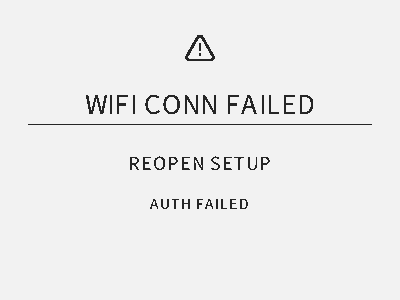

Drawn by firmware. Never a bare `Error` — always paired with the specific
corrective action and, where available, a short reason. Audio is
supplementary; color is never the only cue (monochrome panel).

| Element | Text/Content | Glyph | Scale (→ px) | x,y | Align |
|---|---|---|---|---|---|
| Symbol | warning triangle | — | 32 px | centered, y=32 | center |
| Title | `<failure>` (≤16 chars) | Noto Sans SC | 26 px | centered, y=86 | center |
| Divider | 344 px rule | — | 1 px | y=124 | — |
| Action | `<corrective action>` (≤16 chars) | Noto Sans SC | 18 px | centered, y=150 | center |
| Reason | `<reason>` (≤16 chars, optional) | Noto Sans SC | 14 px | centered, y=194 | center |

Sample: title `WIFI CONN FAILED`, action `REOPEN SETUP`, reason `AUTH FAILED`.
All strings bounded to ≤16 uppercase ASCII chars; longer messages truncate
with `...`.

---

## State transition map

```
                       short KEY / show_page
   Normal page  ─────────────────────────────────►  verified target
   (cached)                                              │
       ▲                                                 │ 2 s dots
       │                                                 ▼
       │                                            normal page
       │ long KEY
       ▼
   MAINTENANCE ──long──► HOLD 3X ──long──► STARTING ──restart──► (D2 Wi-Fi setup)
       │                      │
       │ short                │ short
       │                      │
       ▼                      ▼
   CHECKING UPDATE       last normal page
       │
       ├──► UPDATE READY ──long──► OTA phases (F)
       ├──► UP TO DATE
       └──► UPDATE CHECK FAILED
```

---

## What the hardware never shows

```
- indefinite spinner / blank panel while offline
- color-only status cue
- arbitrary prose on pairing / Wi-Fi / maintenance frames
- credentials in MQTT state, non-serial logs, or the System page
- invented battery percentage (Battery unavailable until carrier installed)
```

---

## Sources

```
firmware/src/local_screen/           pairing_code_frame / maintenance_frame / wifi_setup_frame
                                     / error_frame / embedded Noto Sans SC glyph subset
firmware/src/main.rs                 boot flush, maintenance long-press sequence, OTA-check states
firmware/src/display.rs              DisplayRelease / DisplayPage validation, 400x300 / 15000B / mono1-msb
firmware/src/rlcd.rs                 RlcdRenderer::flush_frame, show_pairing_code
firmware/docs/display.md             ASCII mockups (companion file)
firmware/docs/hardware-interaction.md   KEY gestures, power states, OTA thresholds
firmware/docs/display-assets.md      CJK font and release contract
```
